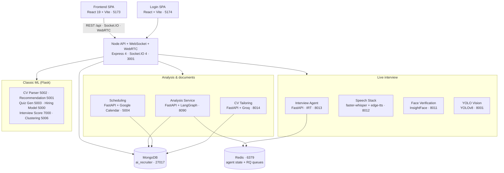

# NextHire — AI Recruiter Platform

An AI-first Applicant Tracking System. Beyond job posting and applications, NextHire runs the
interview itself: an adaptive LLM agent conducts a live voice interview, computer vision watches
for integrity issues, and a LangGraph pipeline turns the recording into a structured hiring report.

The platform is a polyglot set of **16 services** — one Node/Express gateway, two React SPAs, and
thirteen Python services (FastAPI + Flask) — all sharing a single MongoDB database.

> **Status:** built as an end-of-studies (PFE) project. It runs locally via scripted launchers;
> only the scheduling service is containerised so far.

---

## What it does

**For candidates**
- Browse and apply to jobs; CVs are parsed automatically (spaCy, pdfplumber, PaddleOCR).
- **CV Tailoring** — rewrite your CV for a specific job with an LLM, with an anti-hallucination
  check that verifies no facts were invented, then export a PDF.
- Take adaptive quizzes that adjust difficulty to your answers.
- Sit a **live voice interview** with an AI agent that asks follow-up questions in real time.

**For recruiters**
- Job wizard with AI-generated descriptions; candidate/job matching and recommendations.
- **Call rooms** — WebRTC interview rooms with live transcription.
- **Integrity monitoring** — face verification (identity match) plus YOLO detection of phones,
  books, extra screens, and multiple people in frame.
- **Post-interview reports** — a LangGraph pipeline fuses transcript, behaviour, and vision signals
  into a scored report, then ranks and compares candidates.
- Interview scheduling with Google Calendar sync and email notifications.

---

## Architecture

The React SPA talks only to the Node server. Node is the single entry point (BFF): it owns auth,
REST, Socket.IO, and WebRTC signalling, and calls every Python service internally. There is no
dedicated gateway (no Nginx/Kong/Traefik).



### Service map

| Service | Path | Stack | Port |
|---|---|---|---|
| Node API + WebSocket | `Backend/server/` | Express 4, Socket.IO 4, Mongoose 8 | **3001** |
| Frontend SPA | `Frontend/` | React 19, Vite 6, MUI/Tailwind, Three.js | **5173** |
| Login SPA | `Frontend/login/` | React, Vite | **5174** |
| Interview Agent | `Backend/voice_engine/interview_agent/` | FastAPI, custom IRT engine | **8013** |
| Speech Stack (STT/TTS) | `Backend/voice_engine/speech_stack/` | FastAPI, faster-whisper, edge-tts | **8012** |
| Face Verification | `Backend/face_verification_service/` | Flask, InsightFace (`buffalo_l`) | **8011** |
| YOLO Vision | `Backend/yolo-service/` | FastAPI, YOLOv8 | **8001** |
| Analysis Service | `Backend/analysis_service/` | FastAPI, LangGraph, XGBoost, MediaPipe | **8090** |
| CV Tailoring | `Backend/cv_tailoring_service/` | FastAPI, Groq, spaCy, Reactive Resume | **8014** |
| Scheduling | `Backend/scheduling/` | FastAPI, Google Calendar, SMTP | **5004** |
| CV Parser | `Backend/server/AI/iA4.py` | Flask, spaCy, pdfplumber, PaddleOCR | **5002** |
| Recommendation | `Backend/server/AI/recommendation_service.py` | Flask, scikit-learn, TF-IDF | **5001** |
| Quiz Generation | `Backend/server/AI/quiz_generation_service.py` | Flask | **5003** |
| Hiring Model | `Backend/server/AI/hiring_model.py` | Flask, scikit-learn | **5000** |
| Interview Score | `Backend/server/AI/interview_score_model.py` | Flask | **7000** |
| Clustering | `Backend/server/AI/clustering.py` | Flask | **5006** |

Supporting infrastructure: **MongoDB** `ai_recruiter` (27017, shared by all services),
**Redis** (6379 — interview session state and RQ job queues, with in-memory fallback if absent),
and a self-hosted **Reactive Resume** (3000, Docker) used only for CV PDF rendering.

[ARCHITECTURE_INFO.md](ARCHITECTURE_INFO.md) documents every port, endpoint, and inter-service
call with source file references.

---

## Tech stack

| Layer | Technologies |
|---|---|
| Frontend | React 19, Vite 6, MUI, Radix UI, Tailwind, Bootstrap, Three.js, ApexCharts, MediaPipe, webrtc-adapter |
| Backend | Node.js, Express 4, Socket.IO 4, Mongoose 8, JWT, Passport (Google OAuth), Swagger |
| AI services | FastAPI, Flask, LangGraph, Pydantic v2 |
| LLMs | Groq (`gpt-oss-120b`), NVIDIA NIM (`llama-3.3-70b`), Google Gemini, Anthropic, OpenAI, Ollama — selectable via `LLM_PROVIDER` |
| Speech | faster-whisper (STT), edge-tts / Coqui TTS, pyannote.audio (diarisation), silero-vad |
| Vision | YOLOv8 (ultralytics), InsightFace, MediaPipe, DeepFace, py-feat |
| Classic ML | scikit-learn, XGBoost, TF-IDF, spaCy, PaddleOCR |
| Data | MongoDB, Redis + RQ, local disk storage (multer) |
| External | Google Calendar, Google OAuth, SMTP (Gmail), Apify (LinkedIn enrichment) |
| CI | Jenkins (`Jenkinsfile`) |

---

## Getting started

### Prerequisites
- Node.js 18+, Python 3.11+, MongoDB 7.0 running on 27017
- FFmpeg on `PATH` (audio processing)
- Docker (only for Reactive Resume and the scheduling service)
- Redis is optional — both consumers degrade gracefully without it

### 1. Configure environment

```bash
cp .env.example .env
```

Fill in at minimum `MONGO_URI`, `JWT_SECRET_KEY`, and one LLM key (`GROQ_API_KEY` or
`NVIDIA_API_KEY`). Google Calendar, SMTP, and Apify keys are only needed for those features.
`.env` is gitignored — never commit real keys.

### 2. Install

```bash
# Node backend
cd Backend/server && npm install

# Frontend
cd Frontend && npm install

# Python services (shared virtualenv at the repo root)
python -m venv .venv
.venv\Scripts\activate
pip install -r Backend/server/AI/requirements.txt
pip install -r Backend/analysis_service/requirements.txt
pip install -r Backend/voice_engine/requirements.txt
```

### 3. Run

The full interview stack (Node 3001, Frontend 5173, YOLO 8001, Face 8011, Speech 8012,
Agent 8013, CV Tailoring 8014, Analysis 8090) starts with health checks from a single script:

```powershell
.\START_CALLROOM.bat
```

The classic ML services and scheduling have their own launchers:

```powershell
Backend\server\AI\start_all_ai.bat          # Flask services: 5000-5006, 7000
cd Backend\scheduling && docker compose up  # Scheduling 5004 + MongoDB
```

CV Tailoring additionally needs a self-hosted Reactive Resume — see
[docs/cv-tailoring/README.md](docs/cv-tailoring/README.md) for the full setup:

```bash
docker compose -f docker-compose.rxresume.yml up -d
```

Then open **http://localhost:5173**.

---

## Repository layout

```
Backend/
  server/                     Node API, WebSocket, WebRTC, models, routes (+ AI/ Flask services)
  analysis_service/           Post-interview LangGraph report pipeline
  voice_engine/               STT/TTS pipeline, interview agent, comparison agent
  cv_tailoring_service/       LLM CV rewriting + PDF export
  face_verification_service/  Identity verification (InsightFace)
  yolo-service/               Integrity detection (YOLOv8)
  scheduling/                 FastAPI scheduling (Dockerised)
Frontend/                     React 19 SPA (front + back office) and separate login SPA
docs/                         Product vision, diagrams, feature docs
rapportstage/                 LaTeX PFE report — documentation, not a software component
ARCHITECTURE_INFO.md          Full architecture reference with source citations
```

---

## Testing

```bash
cd Backend/server && npm test                       # Node
.venv\Scripts\activate
pytest Backend/analysis_service/tests
pytest Backend/cv_tailoring_service/tests
```

---

## Documentation

- [ARCHITECTURE_INFO.md](ARCHITECTURE_INFO.md) — services, ports, endpoints, data flows
- [docs/project-vision.md](docs/project-vision.md) — product vision
- [docs/cv-tailoring/README.md](docs/cv-tailoring/README.md) — CV Tailoring setup
- [docs/GOOGLE_OAUTH_SETUP_GUIDE.md](docs/GOOGLE_OAUTH_SETUP_GUIDE.md) — OAuth configuration

---

## Repository

https://github.com/hamoudachekir/ai-recruiter-platform
